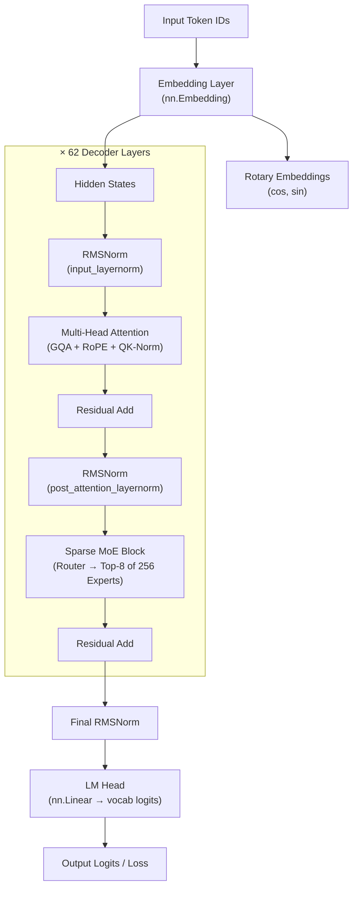
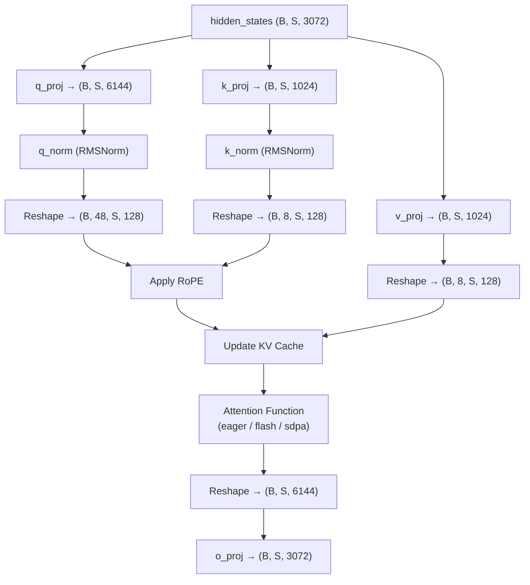

# 🧠 MiniMax-M2.5 Modeling File — Complete Walkthrough

> A deep-dive into every component in [`modeling_minimax_m2.py`](file:///Users/adarsh/Everything/Learning/MiniMax-M2.5/modeling_minimax_m2.py), the concepts behind them, and how to read the file from top to bottom.

---

## 📑 Table of Contents

1. [High-Level Overview](#1-high-level-overview)
2. [Architecture Diagram](#2-architecture-diagram)
3. [Topics & Concepts Involved](#3-topics--concepts-involved)
4. [How to Read the File (Suggested Order)](#4-how-to-read-the-file-suggested-order)
5. [Component-by-Component Walkthrough](#5-component-by-component-walkthrough)
   - 5.1 [Imports & Dependencies](#51-imports--dependencies-lines-1-48)
   - 5.2 [MiniMaxM2MLP — The Expert MLP](#52-minimaxm2mlp--the-expert-mlp-lines-50-65)
   - 5.3 [MiniMaxM2Experts — Expert Collection](#53-minimaxm2experts--expert-collection-lines-68-100)
   - 5.4 [MiniMaxM2SparseMoeBlock — The Router + MoE](#54-minimaxm2sparseblock--the-router--moe-lines-103-129)
   - 5.5 [MiniMaxM2RMSNorm — Normalization](#55-minimaxm2rmsnorm--normalization-lines-132-150)
   - 5.6 [repeat_kv — GQA Helper](#56-repeat_kv--gqa-helper-lines-153-162)
   - 5.7 [eager_attention_forward — Vanilla Attention](#57-eager_attention_forward--vanilla-attention-lines-165-188)
   - 5.8 [rotate_half & apply_rotary_pos_emb — RoPE](#58-rotate_half--apply_rotary_pos_emb--rope-lines-191-233)
   - 5.9 [MiniMaxM2Attention — Full Attention Module](#59-minimaxm2attention--full-attention-module-lines-236-312)
   - 5.10 [MiniMaxM2DecoderLayer — One Transformer Block](#510-minimaxm2decoderlayer--one-transformer-block-lines-315-359)
   - 5.11 [MiniMaxM2RotaryEmbedding — RoPE Module](#511-minimaxm2rotaryembedding--rope-module-lines-362-395)
   - 5.12 [MiniMaxM2PreTrainedModel — Base Class](#512-minimaxm2pretrainedmodel--base-class-lines-398-414)
   - 5.13 [MiniMaxM2Model — The Core Transformer](#513-minimaxm2model--the-core-transformer-lines-417-497)
   - 5.14 [load_balancing_loss_func — Auxiliary Loss](#514-load_balancing_loss_func--auxiliary-loss-lines-500-579)
   - 5.15 [MiniMaxM2ForCausalLM — Causal Language Model Head](#515-minimaxm2forcausallm--causal-language-model-head-lines-582-684)
   - 5.16 [Task-Specific Heads](#516-task-specific-heads-lines-687-696)
6. [Data Flow: End-to-End Forward Pass](#6-data-flow-end-to-end-forward-pass)
7. [Key Config Values from config.json](#7-key-config-values-from-configjson)
8. [Glossary of Key Terms](#8-glossary-of-key-terms)

---

## 1. High-Level Overview

`modeling_minimax_m2.py` (707 lines) defines the **MiniMax-M2.5** transformer model — a **decoder-only, Mixture-of-Experts (MoE) large language model**. It is structurally derived from the Mixtral / Mistral family and adds several architectural innovations:

| Feature | Detail |
|---|---|
| **Architecture** | Decoder-only Transformer with MoE FFN layers |
| **MoE Routing** | Sigmoid scoring + E-score correction bias (not softmax gating) |
| **Experts** | 256 total experts, top-8 selected per token |
| **Attention** | Grouped Query Attention (GQA) with 48 query heads, 8 KV heads |
| **Positional Encoding** | Partial Rotary Position Embeddings (RoPE), `rotary_dim=64` out of `head_dim=128` |
| **Normalization** | RMSNorm (pre-norm) with QK-norm on attention |
| **Activation** | SiLU (Swish) in gated MLP |
| **Layers** | 62 decoder layers |
| **Vocab Size** | 200,064 tokens |
| **Max Context** | 196,608 tokens (~192K) |
| **Quantization** | FP8 (float8_e4m3fn) with block-wise quantization |

---

## 2. Architecture Diagram



---

## 3. Topics & Concepts Involved

Here is every major topic you need to understand to fully read this file:

### 🔵 Core Deep Learning
| Topic | Where it appears | What to know |
|---|---|---|
| **`nn.Module`** | Every class | PyTorch's base class for neural network layers |
| **`nn.Linear`** | MLP, Attention projections | Learnable linear transformation: `y = xW + b` |
| **`nn.Embedding`** | `MiniMaxM2Model` | Lookup table mapping token IDs → dense vectors |
| **Residual Connections** | `DecoderLayer.forward()` | `output = input + layer(input)` — prevents vanishing gradients |
| **Gradient Checkpointing** | `GradientCheckpointingLayer` | Trades compute for memory by recomputing activations during backward pass |

### 🟢 Transformer Architecture
| Topic | Where it appears | What to know |
|---|---|---|
| **Self-Attention** | `MiniMaxM2Attention` | Core mechanism: Q·Kᵀ/√d → softmax → weighted sum of V |
| **Scaled Dot-Product Attention** | `eager_attention_forward()` | The classic attention formula with scaling factor `head_dim ** -0.5` |
| **Multi-Head Attention (MHA)** | `MiniMaxM2Attention` | Parallel attention heads learn different relationships |
| **Grouped Query Attention (GQA)** | `repeat_kv()` + Attention init | Shares K/V heads across multiple Q heads (48 Q : 8 KV = 6:1 ratio) for efficiency |
| **Causal Masking** | `create_causal_mask()` | Prevents attending to future tokens — essential for autoregressive generation |
| **KV Cache** | `past_key_values` / `DynamicCache` | Stores computed K/V tensors to avoid recomputation during generation |
| **Pre-Norm Architecture** | `DecoderLayer.forward()` | Applies LayerNorm *before* attention/FFN (more stable than post-norm) |

### 🟡 Positional Encoding
| Topic | Where it appears | What to know |
|---|---|---|
| **Rotary Position Embedding (RoPE)** | `MiniMaxM2RotaryEmbedding`, `apply_rotary_pos_emb()`, `rotate_half()` | Encodes positions by rotating Q/K vectors — relative position info embedded in dot products |
| **Partial RoPE** | `apply_rotary_pos_emb()` lines 222-232 | Only first `rotary_dim=64` dims get rotated; remaining `64` dims pass through unchanged |
| **Inverse Frequency Bands** | `RotaryEmbedding.__init__()` | `inv_freq = 1 / (θ^(2i/d))` where θ=5,000,000 — controls wavelengths at each dim pair |

### 🔴 Mixture of Experts (MoE)
| Topic | Where it appears | What to know |
|---|---|---|
| **Sparse MoE** | `MiniMaxM2SparseMoeBlock` | Replaces dense FFN with a router that picks a sparse subset of expert MLPs per token |
| **Router / Gating Network** | `SparseMoeBlock.gate` | A single linear layer that produces logits over all 256 experts |
| **Sigmoid Routing** | `route_tokens_to_experts()` | Uses **sigmoid** (not softmax!) to score experts — allows non-competitive expert selection |
| **E-Score Correction Bias** | `e_score_correction_bias` buffer | A learned/loaded bias added to routing scores to correct expert load imbalances |
| **Top-K Selection** | `torch.topk()` in routing | Picks top-8 experts per token |
| **Weight Normalization** | `top_k_weights /= sum(...)` | Selected expert weights are re-normalized to sum to 1 |
| **Expert Parallelism** | `MiniMaxM2Experts.forward()` | Dispatches tokens to selected experts and aggregates results with `index_add_` |
| **Router Jitter Noise** | `SparseMoeBlock.forward()` | Multiplicative uniform noise during training for regularization |
| **Load Balancing Loss** | `load_balancing_loss_func()` | Auxiliary loss that penalizes uneven token distribution across experts (from Switch Transformer) |

### 🟠 Normalization
| Topic | Where it appears | What to know |
|---|---|---|
| **RMS Normalization** | `MiniMaxM2RMSNorm` | Simplified LayerNorm — only uses root-mean-square, no mean subtraction. Faster + equally effective |
| **QK Normalization** | `Attention.__init__()` lines 253-256 | Applies RMSNorm to Q and K projections *before* reshaping into heads — stabilizes attention logits |

### 🟣 Activation Functions
| Topic | Where it appears | What to know |
|---|---|---|
| **SiLU (Swish)** | `MiniMaxM2MLP` via `ACT2FN["silu"]` | `silu(x) = x * sigmoid(x)` — smooth, non-monotonic, works well in transformers |
| **Gated MLP (SwiGLU variant)** | `MiniMaxM2MLP.forward()` | `output = W2(SiLU(W1(x)) * W3(x))` — the gate (W3) modulates the activated signal (W1) |

### ⚪ Training & Optimization
| Topic | Where it appears | What to know |
|---|---|---|
| **Auxiliary Loss** | `load_balancing_loss_func()` | Added to main loss to encourage balanced expert usage; coefficient = 0.001 |
| **Weight Tying** | `_tied_weights_keys` | Option to share embedding and LM head weights (disabled here: `tie_word_embeddings=false`) |
| **Tensor Parallelism** | `_tp_plan`, `base_model_tp_plan` | Specifies how to shard weights across devices (colwise/rowwise splits) |
| **Pipeline Parallelism** | `_pp_plan`, `base_model_pp_plan` | Specifies input/output signatures for splitting model across pipeline stages |

### 🔵 HuggingFace Transformers Integration
| Topic | Where it appears | What to know |
|---|---|---|
| **`PreTrainedModel`** | `MiniMaxM2PreTrainedModel` | Base class providing `from_pretrained()`, weight initialization, etc. |
| **`GenerationMixin`** | `MiniMaxM2ForCausalLM` | Adds `.generate()` method for autoregressive text generation |
| **`PretrainedConfig`** | `MiniMaxM2Config` | Stores all hyperparameters; serializable to/from JSON |
| **Flash Attention** | `_supports_flash_attn = True` | Can use memory-efficient FlashAttention-2 kernels |
| **SDPA** | `_supports_sdpa = True` | Can use PyTorch's `scaled_dot_product_attention` |
| **FlexAttention** | `_supports_flex_attn = True` | Can use PyTorch's FlexAttention backend |
| **`OutputRecorder`** | `_can_record_outputs` | Mechanism to capture intermediate outputs (router logits, hidden states, attentions) |

---

## 4. How to Read the File (Suggested Order)

> [!TIP]
> Don't read the file top-to-bottom. Instead, follow this order — from **smallest building blocks** to the **full model** — so each piece makes sense when you encounter it.

### Reading Order:

```mermaid
graph LR
    A["1. Config<br/>configuration_minimax_m2.py"] --> B["2. RMSNorm<br/>Line 132"]
    B --> C["3. MLP<br/>Line 50"]
    C --> D["4. Experts<br/>Line 68"]
    D --> E["5. MoE Block<br/>Line 103"]
    E --> F["6. RoPE helpers<br/>Lines 191-233"]
    F --> G["7. RoPE Module<br/>Line 362"]
    G --> H["8. Attention helpers<br/>Lines 153-188"]
    H --> I["9. Attention<br/>Line 236"]
    I --> J["10. Decoder Layer<br/>Line 315"]
    J --> K["11. Base Model<br/>Line 417"]
    K --> L["12. LM Head<br/>Line 582"]
    L --> M["13. Aux Loss<br/>Line 500"]
```



| Step | What to Read | Lines | Why |
|------|---|---|---|
| **1** | `MiniMaxM2Config` | [configuration_minimax_m2.py](file:///Users/adarsh/Everything/Learning/MiniMax-M2.5/configuration_minimax_m2.py) | Understand all hyperparameters first |
| **2** | `MiniMaxM2RMSNorm` | [L132-150](file:///Users/adarsh/Everything/Learning/MiniMax-M2.5/modeling_minimax_m2.py#L132-L150) | Simple normalization — used everywhere |
| **3** | `MiniMaxM2MLP` | [L50-65](file:///Users/adarsh/Everything/Learning/MiniMax-M2.5/modeling_minimax_m2.py#L50-L65) | The gated SwiGLU FFN — each expert is one of these |
| **4** | `MiniMaxM2Experts` | [L68-100](file:///Users/adarsh/Everything/Learning/MiniMax-M2.5/modeling_minimax_m2.py#L68-L100) | Collection of MLPs + token dispatch logic |
| **5** | `MiniMaxM2SparseMoeBlock` | [L103-129](file:///Users/adarsh/Everything/Learning/MiniMax-M2.5/modeling_minimax_m2.py#L103-L129) | Router + MoE — the heart of the MoE architecture |
| **6** | `rotate_half` + `apply_rotary_pos_emb` | [L191-233](file:///Users/adarsh/Everything/Learning/MiniMax-M2.5/modeling_minimax_m2.py#L191-L233) | RoPE math — understand how positions are encoded |
| **7** | `MiniMaxM2RotaryEmbedding` | [L362-395](file:///Users/adarsh/Everything/Learning/MiniMax-M2.5/modeling_minimax_m2.py#L362-L395) | Generates cos/sin frequency tables |
| **8** | `repeat_kv` + `eager_attention_forward` | [L153-188](file:///Users/adarsh/Everything/Learning/MiniMax-M2.5/modeling_minimax_m2.py#L153-L188) | GQA expansion + vanilla attention computation |
| **9** | `MiniMaxM2Attention` | [L236-312](file:///Users/adarsh/Everything/Learning/MiniMax-M2.5/modeling_minimax_m2.py#L236-L312) | Full attention module — Q/K/V projections, RoPE, QK-norm, caching |
| **10** | `MiniMaxM2DecoderLayer` | [L315-359](file:///Users/adarsh/Everything/Learning/MiniMax-M2.5/modeling_minimax_m2.py#L315-L359) | One transformer block: norm → attn → residual → norm → MoE → residual |
| **11** | `MiniMaxM2Model` | [L417-497](file:///Users/adarsh/Everything/Learning/MiniMax-M2.5/modeling_minimax_m2.py#L417-L497) | The full transformer backbone |
| **12** | `MiniMaxM2ForCausalLM` | [L582-684](file:///Users/adarsh/Everything/Learning/MiniMax-M2.5/modeling_minimax_m2.py#L582-L684) | LM head + loss computation |
| **13** | `load_balancing_loss_func` | [L500-579](file:///Users/adarsh/Everything/Learning/MiniMax-M2.5/modeling_minimax_m2.py#L500-L579) | Auxiliary loss for expert balancing |

---

## 5. Component-by-Component Walkthrough

### 5.1 Imports & Dependencies (Lines 1-48)

The file begins with auto-generation warnings (it's generated from a modular source file) and Apache 2.0 license.

**Key imports:**
- **`torch`, `nn`** — PyTorch core
- **`ACT2FN`** — Registry mapping activation names (e.g., `"silu"`) to functions
- **`Cache`, `DynamicCache`** — KV cache for efficient generation
- **`GenerationMixin`** — Adds `.generate()` to the causal LM
- **`create_causal_mask` / `create_sliding_window_causal_mask`** — Build attention masks
- **`FlashAttentionKwargs`** — Type hints for Flash Attention parameters
- **`ROPE_INIT_FUNCTIONS`** — Factory for different RoPE initialization strategies
- **`ALL_ATTENTION_FUNCTIONS`** — Registry mapping attention implementation names to functions
- **`MiniMaxM2Config`** — The configuration class (defined in `configuration_minimax_m2.py`)

---

### 5.2 MiniMaxM2MLP — The Expert MLP (Lines 50-65)

```python
class MiniMaxM2MLP(nn.Module):
    # w1: gate projection   (hidden → intermediate)
    # w2: down projection   (intermediate → hidden)
    # w3: up projection     (hidden → intermediate)
    # act_fn: SiLU

    def forward(self, hidden_states):
        return self.w2(self.act_fn(self.w1(x)) * self.w3(x))
```

**Concept: Gated MLP (SwiGLU variant)**

This is *not* a standard 2-layer MLP. It uses a **gated** architecture:

```
output = W2( SiLU(W1(x)) ⊙ W3(x) )
```

- `W1(x)` is passed through SiLU activation → this is the "gated" signal
- `W3(x)` is the "ungated" linear projection
- Element-wise multiplication (`⊙`) combines them — the gate controls information flow
- `W2` projects back down to `hidden_size`

> [!NOTE]
> This is sometimes called SwiGLU (Shazeer, 2020). It uses **3 weight matrices** instead of the usual 2, giving the model more expressiveness per parameter.

**Dimensions for this model:**
- `hidden_size = 3072`
- `intermediate_size = 1536` (unusually, intermediate < hidden — likely because there are 256 experts)

---

### 5.3 MiniMaxM2Experts — Expert Collection (Lines 68-100)

```python
class MiniMaxM2Experts(nn.ModuleList):
    # Contains `num_local_experts` (256) MiniMaxM2MLP instances
```

**Key logic in `forward()`:**

1. Creates a one-hot expert mask from the top-k indices: shape `(num_experts, top_k, num_tokens)`
2. Finds which experts were actually selected by *any* token
3. For each active expert:
   - Finds which tokens selected it and at which rank
   - Runs those tokens through the expert MLP
   - Multiplies by the routing weight
   - Accumulates into `final_hidden_states` via `index_add_`

> [!IMPORTANT]
> This is a **sparse** computation — only the selected experts are run, and each expert only processes tokens that were routed to it. This is what makes MoE efficient: even with 256 experts, each token only activates 8.

---

### 5.4 MiniMaxM2SparseMoeBlock — The Router + MoE (Lines 103-129)

This is the complete MoE layer that replaces a standard dense FFN.

**Components:**
- `gate`: `nn.Linear(hidden_size, num_experts)` — the router
- `experts`: `MiniMaxM2Experts` — the collection of MLPs
- `e_score_correction_bias`: a buffer (loaded from checkpoint) for bias correction

**Routing Algorithm (`route_tokens_to_experts`):**

```python
routing_weights = sigmoid(router_logits)          # NOT softmax!
scores = routing_weights + e_score_correction_bias  # bias correction
top_k_index = topk(scores, k=8)                     # pick top-8
top_k_weights = routing_weights.gather(1, top_k_index)  # get original weights
top_k_weights /= top_k_weights.sum(dim=-1, keepdim=True)  # normalize
```

> [!WARNING]
> **Sigmoid routing is unusual!** Most MoE models use softmax gating (competitive: experts fight for tokens). Sigmoid allows each expert to have an independently high or low score. The top-k selection then picks the best among these independent scores, and the **e_score_correction_bias** helps prevent expert collapse.

**Forward pass:**
1. Optionally applies jitter noise during training (multiplicative uniform noise)
2. Flattens batch and sequence dims: `(B, S, D) → (B*S, D)`
3. Computes router logits via the gate
4. Routes tokens to experts
5. Runs selected experts
6. Reshapes back to `(B, S, D)`
7. Returns `(hidden_states, router_logits)` — router logits are needed for auxiliary loss

---

### 5.5 MiniMaxM2RMSNorm — Normalization (Lines 132-150)

```python
def forward(self, hidden_states):
    variance = hidden_states.pow(2).mean(-1, keepdim=True)
    hidden_states = hidden_states * rsqrt(variance + eps)
    return self.weight * hidden_states
```

**Concept: Root Mean Square Normalization**

Unlike LayerNorm which both centers (subtracts mean) and scales, RMSNorm only **scales**:

```
RMSNorm(x) = γ * x / √(mean(x²) + ε)
```

- Simpler and faster than LayerNorm (no mean computation)
- `self.weight` (γ) is a learnable per-element scale parameter
- Computation done in `float32` for numerical stability, then cast back

> [!NOTE]
> The `@use_kernel_forward_from_hub("RMSNorm")` decorator allows loading optimized CUDA kernels from the HuggingFace Hub at runtime for faster RMSNorm computation.

---

### 5.6 repeat_kv — GQA Helper (Lines 153-162)

```python
def repeat_kv(hidden_states, n_rep):
    # (B, num_kv_heads, S, D) → (B, num_kv_heads * n_rep, S, D)
```

**Concept: Grouped Query Attention (GQA)**

In standard Multi-Head Attention, each head has its own Q, K, V. In GQA:
- There are **48 query heads** but only **8 key-value heads**
- Each KV head is shared by `48 / 8 = 6` query heads
- `repeat_kv` replicates each KV head 6 times to match the query head count

This saves memory and compute (fewer KV projections) while maintaining attention quality.

---

### 5.7 eager_attention_forward — Vanilla Attention (Lines 165-188)

The standard scaled dot-product attention implemented manually:

```
1. Expand KV heads to match Q heads (via repeat_kv)
2. attn_weights = Q @ K^T * scaling
3. Apply causal mask (additive)
4. softmax → dropout → multiply by V
5. Transpose and return
```

This is the **fallback** implementation. The model also supports:
- **Flash Attention 2** (`_supports_flash_attn = True`)
- **SDPA** (`_supports_sdpa = True`)
- **Flex Attention** (`_supports_flex_attn = True`)

---

### 5.8 rotate_half & apply_rotary_pos_emb — RoPE (Lines 191-233)

**Concept: Rotary Position Embeddings (RoPE)**

RoPE encodes position information by **rotating** query and key vectors in 2D subspaces. The key insight: when you compute `Q · K^T`, the rotation angles cancel out to give a function of the *relative* position difference.

**`rotate_half(x)`:**
```python
x1 = x[..., :d//2]    # first half
x2 = x[..., d//2:]    # second half
return cat(-x2, x1)   # swap and negate
```
This implements a 90° rotation in each 2D subspace.

**`apply_rotary_pos_emb(q, k, cos, sin)`:**
```python
q_embed = (q_rot * cos) + (rotate_half(q_rot) * sin)
k_embed = (k_rot * cos) + (rotate_half(k_rot) * sin)
```
This is the rotation formula: `R(θ) · x = x·cos(θ) + rotate_half(x)·sin(θ)`

**⭐ Partial RoPE:** Only the first `rotary_dim=64` dimensions (out of `head_dim=128`) get rotated. The remaining 64 dimensions pass through unchanged:

```python
q_rot, q_pass = q[..., :rotary_dim], q[..., rotary_dim:]
# ... apply rotation to q_rot ...
q_embed = torch.cat([q_embed, q_pass], dim=-1)
```

> [!NOTE]
> Partial RoPE means half the attention dimensions are position-aware and half are purely content-based. This can help the model learn both positional patterns and position-independent semantic patterns.

---

### 5.9 MiniMaxM2Attention — Full Attention Module (Lines 236-312)

**Init — Linear Projections:**

| Projection | Shape | Description |
|---|---|---|
| `q_proj` | `(3072, 48 × 128) = (3072, 6144)` | Query projection |
| `k_proj` | `(3072, 8 × 128) = (3072, 1024)` | Key projection |
| `v_proj` | `(3072, 8 × 128) = (3072, 1024)` | Value projection |
| `o_proj` | `(6144, 3072)` | Output projection |

**QK Normalization (`use_qk_norm = True`):**
- `q_norm`: RMSNorm over the full flattened Q dimension (`48 * 128 = 6144`)
- `k_norm`: RMSNorm over the full flattened K dimension (`8 * 128 = 1024`)
- Applied **before** reshaping into heads and **before** RoPE

> [!IMPORTANT]
> QK-Norm is applied in the "flat" representation (before splitting into heads). This is the `per_layer` normalization style specified in `config.json`.

**Forward Pass Flow:**



---

### 5.10 MiniMaxM2DecoderLayer — One Transformer Block (Lines 315-359)

Each of the 62 decoder layers follows this pattern:

```python
def forward(self, hidden_states, ...):
    # ---- Attention sub-block ----
    residual = hidden_states
    hidden_states = self.input_layernorm(hidden_states)        # Pre-norm
    hidden_states, _ = self.self_attn(hidden_states, ...)      # Attention
    hidden_states = residual + hidden_states                    # Residual

    # ---- MoE FFN sub-block ----
    residual = hidden_states
    hidden_states = self.post_attention_layernorm(hidden_states) # Pre-norm
    hidden_states, _ = self.block_sparse_moe(hidden_states)      # MoE
    hidden_states = residual + hidden_states                      # Residual

    return hidden_states
```

> [!NOTE]
> This is a **Pre-Norm** architecture (norm comes before each sub-layer, as in GPT-2+). It extends `GradientCheckpointingLayer` which allows automatic activation checkpointing for memory savings.

---

### 5.11 MiniMaxM2RotaryEmbedding — RoPE Module (Lines 362-395)

Generates the cos/sin tables used by `apply_rotary_pos_emb()`.

**Init:**
1. Determines rope type (default/dynamic/etc.) from config
2. Calls `ROPE_INIT_FUNCTIONS[rope_type]` to get `inv_freq` and `attention_scaling`
3. `inv_freq` shape: `(rotary_dim // 2,)` = `(32,)` for `rotary_dim=64`

**Forward:**
```python
freqs = inv_freq @ position_ids  # outer product: (B, 32, 1) @ (B, 1, S) → (B, 32, S)
emb = cat(freqs, freqs)          # duplicate: (B, 64, S) — for sin/cos of each pair
cos = emb.cos() * attention_scaling
sin = emb.sin() * attention_scaling
```

**Key parameter: `rope_theta = 5,000,000`**  
This is the base frequency. Higher values (compared to the original 10,000 in RoPE paper) allow the model to handle much longer sequences (196K context).

---

### 5.12 MiniMaxM2PreTrainedModel — Base Class (Lines 398-414)

A configuration class that sets model-wide HuggingFace options:

| Attribute | Value | Meaning |
|---|---|---|
| `base_model_prefix` | `"model"` | Where to find the base model in `ForCausalLM` |
| `_no_split_modules` | `["MiniMaxM2DecoderLayer"]` | Don't split decoder layers across devices |
| `_supports_flash_attn` | `True` | Flash Attention 2 compatible |
| `_supports_sdpa` | `True` | PyTorch SDPA compatible |
| `_can_compile_fullgraph` | `False` | MoE models can't use `torch.compile` full graph (due to `torch.where`) |
| `_can_record_outputs` | dict | Specifies how to capture intermediate outputs |

---

### 5.13 MiniMaxM2Model — The Core Transformer (Lines 417-497)

This is the **backbone** of the model — everything except the language modeling head.

**Components:**
- `embed_tokens`: `nn.Embedding(200064, 3072)` — token embeddings
- `layers`: `nn.ModuleList` of 62 `MiniMaxM2DecoderLayer`s
- `norm`: Final `MiniMaxM2RMSNorm`
- `rotary_emb`: `MiniMaxM2RotaryEmbedding` — shared across all layers

**Forward Pass:**

```python
def forward(self, input_ids, attention_mask, position_ids, past_key_values, ...):
    # 1. Convert token IDs to embeddings
    hidden_states = self.embed_tokens(input_ids)

    # 2. Build or reuse KV cache
    if use_cache and past_key_values is None:
        past_key_values = DynamicCache()

    # 3. Compute cache position (for incremental decoding)
    cache_position = arange(past_seen_tokens, past_seen_tokens + seq_len)

    # 4. Build causal attention mask
    causal_mask = create_causal_mask(...)  # or sliding_window variant

    # 5. Compute RoPE embeddings (shared across all layers)
    position_embeddings = self.rotary_emb(hidden_states, position_ids)

    # 6. Pass through all 62 decoder layers
    for layer in self.layers:
        hidden_states = layer(hidden_states, position_embeddings, causal_mask, ...)

    # 7. Final normalization
    hidden_states = self.norm(hidden_states)

    return MoeModelOutputWithPast(last_hidden_state=hidden_states, ...)
```

> [!IMPORTANT]
> The RoPE embeddings are computed **once** and shared across all 62 layers. This is an optimization — no need to recompute cos/sin for each layer.

---

### 5.14 load_balancing_loss_func — Auxiliary Loss (Lines 500-579)

**Concept: Expert Load Balancing (from Switch Transformer paper)**

Without this loss, the router might learn to send all tokens to the same few experts (expert collapse). This auxiliary loss encourages uniform distribution.

**How it works:**

1. Concatenate router logits from all 62 layers
2. For each expert, compute:
   - `f` = fraction of tokens routed to it (from one-hot expert assignments)
   - `P` = average routing probability for it (from softmax of logits)
3. Loss = `num_experts * Σ(f * P)`

The loss is high when both `f` and `P` are high for the same experts (i.e., popular experts get even more popular). It pushes the model toward balanced routing.

**With attention mask:**
- Pads are excluded from the computation using the attention mask
- This prevents padding tokens from biasing the load balancing statistics

> [!NOTE]
> Interestingly, this loss function uses **softmax** for computing `routing_weights`, even though the actual routing in `SparseMoeBlock` uses **sigmoid**. This is because the load balancing loss was designed for the Switch Transformer formulation.

---

### 5.15 MiniMaxM2ForCausalLM — Causal Language Model Head (Lines 582-684)

The top-level model that adds language modeling capability.

**Components:**
- `model`: `MiniMaxM2Model` (the transformer backbone)
- `lm_head`: `nn.Linear(3072, 200064)` — projects hidden states to vocabulary logits
- Loss-related config: `router_aux_loss_coef`, `num_experts`, `num_experts_per_tok`

**Forward Pass:**

```python
def forward(self, input_ids, labels, output_router_logits, ...):
    # 1. Run the transformer backbone
    outputs = self.model(input_ids, ...)

    # 2. Compute logits (only for positions we need — optimization!)
    hidden_states = outputs.last_hidden_state
    logits = self.lm_head(hidden_states[:, slice_indices, :])

    # 3. Compute language modeling loss (if labels provided)
    if labels is not None:
        loss = self.loss_function(logits, labels, self.vocab_size)

    # 4. Compute auxiliary load balancing loss (if requested)
    if output_router_logits:
        aux_loss = load_balancing_loss_func(router_logits, ...)
        if labels is not None:
            loss += 0.001 * aux_loss  # router_aux_loss_coef = 0.001

    return MoeCausalLMOutputWithPast(loss, aux_loss, logits, ...)
```

**`logits_to_keep` optimization:**
When `logits_to_keep` is set (e.g., to 1 during generation), only the last N token positions are projected through `lm_head`. This avoids computing vocabulary logits for all positions, saving significant memory and compute.

---

### 5.16 Task-Specific Heads (Lines 687-696)

Three additional model heads are defined as thin wrappers:

```python
class MiniMaxM2ForSequenceClassification(GenericForSequenceClassification, MiniMaxM2PreTrainedModel):
    pass

class MiniMaxM2ForTokenClassification(GenericForTokenClassification, MiniMaxM2PreTrainedModel):
    pass

class MiniMaxM2ForQuestionAnswering(GenericForQuestionAnswering, MiniMaxM2PreTrainedModel):
    pass
```

These use generic HuggingFace implementations that add classification/QA heads on top of the base model. They inherit all the MoE architecture from `MiniMaxM2PreTrainedModel`.

---

## 6. Data Flow: End-to-End Forward Pass

Here's the complete journey of a single forward pass during training:

```
Token IDs: [42, 1337, 99, ...]
    │
    ▼
┌─────────────────────────────────────────────────┐
│ 1. EMBEDDING                                     │
│    nn.Embedding(200064, 3072)                    │
│    [42, 1337, 99, ...] → (B, S, 3072)           │
└─────────────────────────────────────────────────┘
    │
    ▼
┌─────────────────────────────────────────────────┐
│ 2. POSITION EMBEDDINGS (computed once)           │
│    MiniMaxM2RotaryEmbedding                      │
│    position_ids → (cos, sin) tables              │
│    rope_theta = 5,000,000                        │
└─────────────────────────────────────────────────┘
    │
    ▼
┌─────────────────────────────────────────────────┐
│ 3. CAUSAL MASK (computed once)                   │
│    Lower-triangular mask for autoregressive attn │
└─────────────────────────────────────────────────┘
    │
    ▼
┌─────────────────────────────────────────────────┐
│ 4. DECODER LAYER (×62)                           │
│                                                  │
│  ┌───────────────────────────────────────┐       │
│  │ 4a. input_layernorm (RMSNorm)         │       │
│  │ 4b. Self-Attention (GQA + QK-Norm)    │       │
│  │     - Q/K/V projections               │       │
│  │     - QK normalization (RMSNorm)      │       │
│  │     - Reshape into heads              │       │
│  │     - Apply partial RoPE (64/128 dim) │       │
│  │     - KV Cache update                 │       │
│  │     - Attention (eager/flash/sdpa)    │       │
│  │     - Output projection              │       │
│  │ 4c. Residual connection              │       │
│  │                                       │       │
│  │ 4d. post_attention_layernorm (RMSNorm)│       │
│  │ 4e. Sparse MoE Block                 │       │
│  │     - Gate: Linear → 256 logits       │       │
│  │     - Sigmoid → Top-8 selection       │       │
│  │     - Dispatch to 8 expert MLPs       │       │
│  │     - Weighted sum of expert outputs  │       │
│  │ 4f. Residual connection              │       │
│  └───────────────────────────────────────┘       │
└─────────────────────────────────────────────────┘
    │
    ▼
┌─────────────────────────────────────────────────┐
│ 5. FINAL NORM (RMSNorm)                         │
└─────────────────────────────────────────────────┘
    │
    ▼
┌─────────────────────────────────────────────────┐
│ 6. LM HEAD                                      │
│    nn.Linear(3072, 200064)                       │
│    → vocabulary logits                           │
└─────────────────────────────────────────────────┘
    │
    ▼
┌─────────────────────────────────────────────────┐
│ 7. LOSS COMPUTATION                              │
│    - Cross-entropy loss (main LM loss)           │
│    - Load balancing aux loss (× 0.001)           │
│    - Total loss = LM loss + aux loss             │
└─────────────────────────────────────────────────┘
```

---

## 7. Key Config Values from config.json

These are the actual hyperparameters for the MiniMax-M2.5 model:

| Parameter | Value | Meaning |
|---|---|---|
| `hidden_size` | 3072 | Model dimension |
| `intermediate_size` | 1536 | Expert MLP intermediate dim |
| `num_hidden_layers` | 62 | Number of transformer blocks |
| `num_attention_heads` | 48 | Query heads per layer |
| `num_key_value_heads` | 8 | KV heads per layer (GQA ratio 6:1) |
| `head_dim` | 128 | Dimension per attention head |
| `rotary_dim` | 64 | Dimensions with RoPE applied (partial RoPE) |
| `num_local_experts` | 256 | Total experts in each MoE layer |
| `num_experts_per_tok` | 8 | Experts activated per token |
| `vocab_size` | 200,064 | Vocabulary size |
| `max_position_embeddings` | 196,608 | Maximum context length (~192K) |
| `rope_theta` | 5,000,000 | RoPE base frequency |
| `hidden_act` | `"silu"` | Activation function in MLP |
| `rms_norm_eps` | 1e-6 | Epsilon for RMSNorm |
| `scoring_func` | `"sigmoid"` | Router scoring function |
| `use_qk_norm` | `true` | Whether to apply QK normalization |
| `qk_norm_type` | `"per_layer"` | QK norm applied per layer (flat) |
| `use_routing_bias` | `true` | Use e-score correction bias |
| `use_mtp` | `true` | Use multi-token prediction (in separate modules) |
| `num_mtp_modules` | 3 | Number of MTP modules |
| `mtp_transformer_layers` | 1 | Transformer layers per MTP module |
| `tie_word_embeddings` | `false` | Embedding ≠ LM head weights |
| `quant_method` | `"fp8"` | FP8 quantization |

> [!NOTE]
> **Active parameters per token:** Although the total model has 256 experts × 62 layers, each token only uses 8 experts per layer. This means the "active" parameter count per token is much smaller than the total parameter count.

---

## 8. Glossary of Key Terms

| Term | Definition |
|---|---|
| **MoE** | Mixture of Experts — a technique where tokens are routed to a subset of "expert" networks |
| **GQA** | Grouped Query Attention — shares K/V heads across multiple Q heads for efficiency |
| **RoPE** | Rotary Position Embedding — encodes position via rotation matrices applied to Q/K |
| **RMSNorm** | Root Mean Square Normalization — a simplified layer norm without mean centering |
| **SiLU / Swish** | `x * sigmoid(x)` — a smooth activation function |
| **SwiGLU** | SiLU-Gated Linear Unit — a gated MLP variant that uses SiLU as the gate |
| **KV Cache** | Stored key/value tensors from past tokens to avoid recomputation during generation |
| **Causal Mask** | Attention mask preventing tokens from attending to future positions |
| **Flash Attention** | Memory-efficient attention algorithm that avoids materializing the full attention matrix |
| **SDPA** | Scaled Dot-Product Attention — PyTorch's optimized attention implementation |
| **Top-K Routing** | Selecting the K highest-scoring experts for each token |
| **Load Balancing Loss** | Auxiliary loss encouraging even distribution of tokens across experts |
| **Pre-Norm** | Applying normalization before (not after) each sub-layer |
| **Residual Connection** | Adding input directly to output: `y = x + f(x)` — prevents vanishing gradients |
| **Gradient Checkpointing** | Memory optimization that trades compute for memory by recomputing activations |
| **Tensor Parallelism** | Splitting weight matrices across multiple GPUs (column-wise or row-wise) |
| **Pipeline Parallelism** | Splitting model layers across multiple GPUs in a pipeline |
| **FP8 Quantization** | Using 8-bit floating point for weights to reduce memory and increase throughput |

---

> [!TIP]
> **Prerequisite Reading Order for Learning:**
> 1. **"Attention Is All You Need"** (Vaswani et al., 2017) — Original Transformer
> 2. **"RoFormer: Enhanced Transformer with Rotary Position Embedding"** (Su et al., 2021) — RoPE
> 3. **"GLU Variants Improve Transformer"** (Shazeer, 2020) — SwiGLU MLP
> 4. **"GQA: Training Generalized Multi-Query Transformer Models from Multi-Head Checkpoints"** (Ainslie et al., 2023) — GQA
> 5. **"Switch Transformers"** (Fedus et al., 2021) — MoE + Load Balancing Loss
> 6. **"Mixtral of Experts"** (Jiang et al., 2024) — Sparse MoE LLM (closest architectural ancestor)
